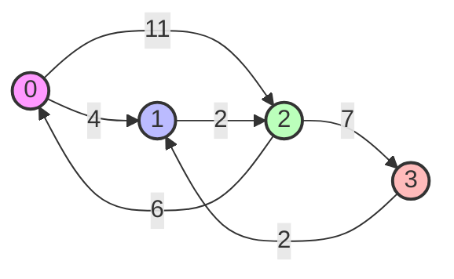

# Visualización de Floyd-Warshall

## 1. Diagrama del Grafo (Mermaid)

## 2. Ejecución Paso a Paso (Tabla HTML)

Esta tabla muestra la matriz de distancias $D^{(k)}$ después de considerar cada nodo $k$ como intermedio.

<table>
    <tr class="header-row">
        <th>k (Pivote)</th>
        <th>Matriz de Distancias Resultante</th>
        <th>Cambios Significativos</th>
    </tr>
    <tr>
        <td><strong>Inicial (k=-1)</strong></td>
        <td>
            <table>
                <tr><td>0</td><td>4</td><td>11</td><td>∞</td></tr>
                <tr><td>∞</td><td>0</td><td>2</td><td>∞</td></tr>
                <tr><td>6</td><td>∞</td><td>0</td><td>7</td></tr>
                <tr><td>∞</td><td>2</td><td>∞</td><td>0</td></tr>
            </table>
        </td>
        <td>Configuración inicial basada en pesos directos.</td>
    </tr>
    <tr>
        <td><strong>k=0</strong> (Usando nodo 0)</td>
        <td>
            <table>
                <tr><td>0</td><td>4</td><td>11</td><td>∞</td></tr>
                <tr><td>∞</td><td>0</td><td>2</td><td>∞</td></tr>
                <tr><td>6</td><td class="highlight">10</td><td>0</td><td>7</td></tr>
                <tr><td>∞</td><td>2</td><td>∞</td><td>0</td></tr>
            </table>
        </td>
        <td>
            2->1 mejorado: 2->0->1 (6+4=10) < ∞
        </td>
    </tr>
    <tr>
        <td><strong>k=1</strong> (Usando nodo 1)</td>
        <td>
            <table>
                <tr><td>0</td><td>4</td><td class="highlight">6</td><td>∞</td></tr>
                <tr><td>∞</td><td>0</td><td>2</td><td>∞</td></tr>
                <tr><td>6</td><td>10</td><td>0</td><td>7</td></tr>
                <tr><td>∞</td><td>2</td><td class="highlight">4</td><td>0</td></tr>
            </table>
        </td>
        <td>
            0->2 mejorado: 0->1->2 (4+2=6) < 11 
            3->2 mejorado: 3->1->2 (2+2=4) < ∞
        </td>
    </tr>
    <tr>
        <td><strong>k=2</strong> (Usando nodo 2)</td>
        <td>
            <table>
                <tr><td>0</td><td>4</td><td>6</td><td class="highlight">13</td></tr>
                <tr><td><td class="highlight">8</td><td>0</td><td>2</td><td class="highlight">9</td></tr>
                <tr><td>6</td><td>10</td><td>0</td><td>7</td></tr>
                <tr><td><td class="highlight">10</td><td>2</td><td>4</td><td class="highlight">11</td></tr>
            </table>
        </td>
        <td>
            0->3: 0->2->3 (6+7=13) 
            1->0: 1->2->0 (2+6=8) 
            1->3: 1->2->3 (2+7=9) 
            3->0: 3->2->0 (4+6=10) 
            3->3: 3->2->3 (4+7=11) (Ciclo positivo)
        </td>
    </tr>
    <tr>
        <td><strong>k=3</strong> (Usando nodo 3)</td>
        <td>
            <table>
                <tr><td>0</td><td>4</td><td>6</td><td>13</td></tr>
                <tr><td>8</td><td>0</td><td>2</td><td>9</td></tr>
                <tr><td>6</td><td><td class="highlight">9</td><td>0</td><td>7</td></tr>
                <tr><td>10</td><td>2</td><td>4</td><td>11</td></tr>
            </table>
        </td>
        <td>
            2->1 mejorado: 2->3->1 (7+2=9) < 10
        </td>
    </tr>
</table>

## Sugerencias de Estilo

-   **Celdas Modificadas:** Usar un color de fondo suave (ej. amarillo claro `#ffffcc`) para resaltar los valores que cambiaron en la iteración actual.
-   **Infinito:** Representar `math.inf` como `∞` para legibilidad.
-   **Diagonal:** Mantener la diagonal en gris claro o negrita para referencia visual rápida (debe ser siempre 0 si no hay ciclos negativos).
