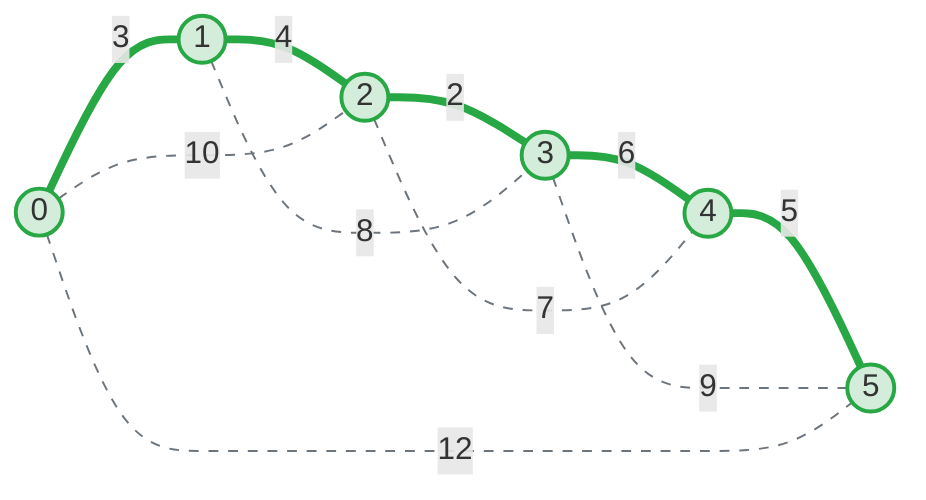

# Actividad 3: Visualización de MST con Mermaid

## Contexto

-   **Nodos:** 6 (0 a 5)
-   **MST Calculado:** (0,1,3), (1,2,4), (2,3,2), (3,4,6), (4,5,5).
-   **Aristas Adicionales (No MST):** Se han añadido aristas hipotéticas para completar el grafo y mostrar la selección.

## 1. Código Mermaid

## 2. Convención de Colores y Estilos

Para facilitar la lectura del diagrama por parte de un no experto, se ha utilizado la siguiente convención visual:

-   **Nodos (Círculos):**

    -   🟢 **Verde Claro (Relleno #d4edda, Borde #28a745):** Indica que el nodo ha sido conectado exitosamente a la red principal (MST). En un MST completo, todos los nodos deberían tener este color.
    -   ⚪ **Gris (Relleno #f8f9fa):** Se usaría para nodos que aún no han sido alcanzados o están aislados (no aplica en este caso final).

-   **Aristas (Líneas):**
    -   **Línea Continua y Gruesa (Verde):** Representa las conexiones **activas** seleccionadas por el algoritmo. Son los "cables" que realmente se instalarán. Representan el camino de costo mínimo.
    -   **Línea Punteada y Fina (Gris):** Representa las conexiones **posibles pero descartadas**. Son caminos redundantes o demasiado costosos que el algoritmo evaluó pero decidió no usar para evitar ciclos o ahorrar costos.

## 3. Explicación para No Expertos

> "Imagina que este diagrama representa un plan para conectar 6 ciudades con fibra óptica.
>
> Las **líneas verdes gruesas** muestran el diseño final de la red. Hemos elegido estas rutas específicas porque nos permiten conectar todas las ciudades gastando la menor cantidad de dinero posible (la suma de los números en las líneas verdes es el costo total más bajo).
>
> Las **líneas grises punteadas** son otras rutas que existían en el mapa, pero que decidimos no construir. ¿Por qué? Porque si las construyéramos, estaríamos gastando dinero extra para conectar ciudades que ya están conectadas por otro lado (creando redundancia innecesaria). Por ejemplo, no construimos la ruta directa entre 0 y 2 (costo 10) porque podemos ir de 0 a 1 y luego a 2 por un costo total de 7 (3+4), ¡lo cual es más barato!"
