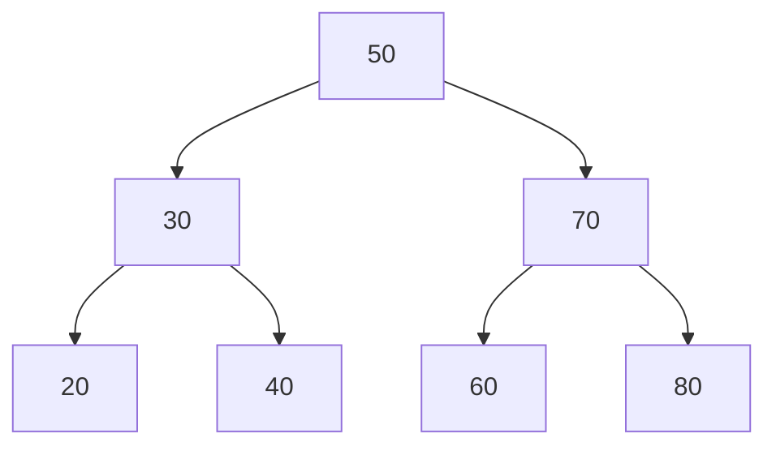

# Solución: Depuración de implementación de eliminación BST

## 1. Identificación del Error

El error se encuentra en el **Caso 3: Eliminación de un nodo con dos hijos**.

En tu código:

```python
# Caso 3: Dos hijos (BUG AQUÍ)
sucesor = self._encontrar_minimo(nodo.derecho)
nodo.valor = sucesor.valor
# FALTA: nodo.derecho = self._eliminar_recursivo(nodo.derecho, sucesor.valor)
```

**Explicación:**
Cuando eliminas un nodo con dos hijos, la estrategia correcta es:

1. Encontrar el sucesor inorden (el nodo más pequeño del subárbol derecho).
2. Copiar el valor del sucesor al nodo que queríamos eliminar.
3. **Eliminar el nodo sucesor original** (que ahora está duplicado).

Tu código realiza el paso 1 y 2, pero **omite el paso 3**. Esto resulta en que el valor del sucesor aparece dos veces en el árbol: en su posición original y en la posición del nodo eliminado.

## 2. Ejecución Paso a Paso (Trace)

**Árbol Inicial:**



**Operación:** `bst.eliminar(70)`

1. **Búsqueda:**

    - `70 > 50` → ir derecha.
    - `70 == 70` → ¡Encontrado!

2. **Evaluación de casos:**

    - ¿Es hoja? No (tiene hijos 60 y 80).
    - ¿Tiene un solo hijo? No.
    - **Caso 3 (Dos hijos):** Ejecutar lógica.

3. **Ejecución del código con bug:**
    - `sucesor = self._encontrar_minimo(nodo.derecho)`
        - Busca mínimo en subárbol derecho de 70 (que es el nodo 80).
        - El mínimo es **80** (porque 80 no tiene hijo izquierdo, o si hubiera 75 sería ese). _Corrección: En el ejemplo, hijos de 70 son 60 y 80. El mínimo del subárbol derecho (raíz 80) es 80._
        - Espera, el subárbol derecho de 70 es el nodo 80. El mínimo de ese subárbol es 80.
        - **Corrección:** El sucesor inorden de 70 es el mínimo de su subárbol derecho.
            - Subárbol derecho de 70 es el nodo 80.
            - `_encontrar_minimo(80)` retorna 80.
    - `nodo.valor = sucesor.valor`
        - El nodo que tenía 70 ahora tiene valor **80**.
    - **¡FIN!** (Falta la eliminación recursiva).

**Resultado obtenido (Incorrecto):**
El nodo 70 se convirtió en 80. Pero el nodo 80 original sigue existiendo como hijo derecho.

-   Estructura resultante:
    -   50 (raíz)
    -   Der: 80 (antes 70)
        -   Izq: 60
        -   Der: 80 (el original)

**Inorden resultante:** `[20, 30, 40, 50, 60, 80, 80]`
(El 80 aparece duplicado).

## 3. Código Corregido

```python
    def _eliminar_recursivo(self, nodo, valor):
        if nodo is None:
            return None

        if valor < nodo.valor:
            nodo.izquierdo = self._eliminar_recursivo(nodo.izquierdo, valor)
        elif valor > nodo.valor:
            nodo.derecho = self._eliminar_recursivo(nodo.derecho, valor)
        else:
            # Caso 1: Hoja
            if nodo.izquierdo is None and nodo.derecho is None:
                return None

            # Caso 2: Un hijo
            if nodo.izquierdo is None:
                return nodo.derecho
            if nodo.derecho is None:
                return nodo.izquierdo

            # Caso 3: Dos hijos (CORREGIDO)
            # 1. Encontrar sucesor
            sucesor = self._encontrar_minimo(nodo.derecho)

            # 2. Copiar valor
            nodo.valor = sucesor.valor

            # 3. Eliminar el sucesor original del subárbol derecho
            # Importante: Buscamos eliminar el VALOR del sucesor en el subárbol derecho
            nodo.derecho = self._eliminar_recursivo(nodo.derecho, sucesor.valor)

        return nodo
```

## 4. Casos de Prueba Adicionales

Aquí tienes 3 casos para cubrir todos los escenarios:

```python
# Caso A: Eliminar una hoja (Caso 1)
# Eliminar 20. El 30 debe quedar con hijo izquierdo None.
bst.eliminar(20)
print(bst.inorden()) # Esperado: [30, 40, 50, 60, 80]

# Caso B: Eliminar nodo con un hijo (Caso 2)
# Primero insertamos un nodo para crear este caso, ej: insertar 35 (hijo de 40)
bst.insertar(35)
# Ahora 40 tiene un hijo (35). Eliminamos 40.
bst.eliminar(40)
print(bst.inorden()) # Esperado: [30, 35, 50, 60, 80] (35 sube a ocupar lugar de 40)

# Caso C: Eliminar la raíz con dos hijos (Caso 3 complejo)
# La raíz es 50. Su sucesor será el mínimo del lado derecho (60).
bst.eliminar(50)
print(bst.inorden()) # Esperado: [30, 35, 60, 80] (60 es nueva raíz)
```
